# 02_basic_flutter

Nama : Guntur Bagus Aryoga  
NIM : 2031710131  
Kelas : MI-2C  
Prodi : D3 Manajemen Informatika  

## Hasil Praktikum 
#
### Built In Widget
#### 1. Text Widget
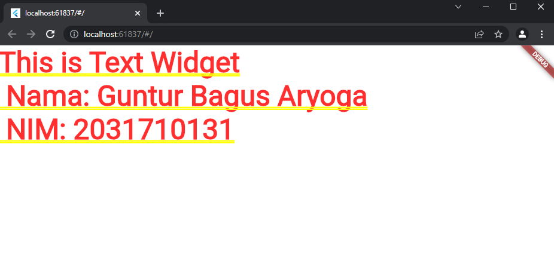
#### 2. Image Widget
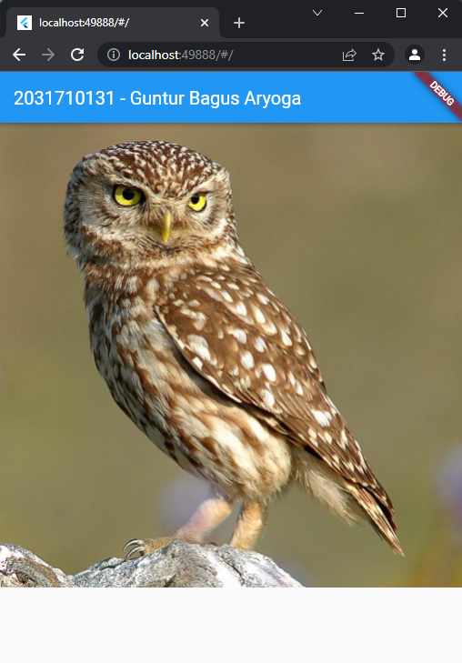
#### 3. IOS Cupertino
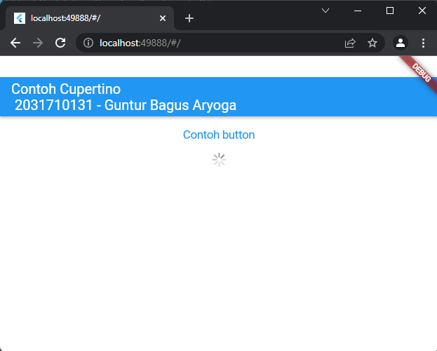
#### 4. Button
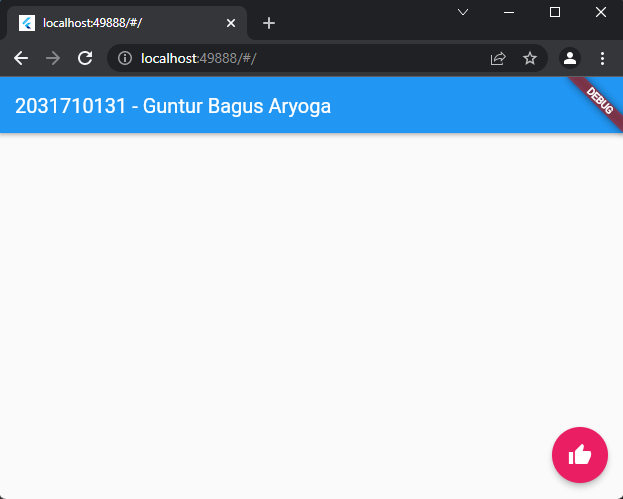
#### 5. Scaffold

#### 6. Alert Dialog
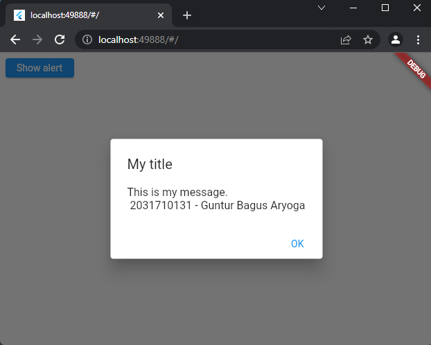
#### 7. Input Widget
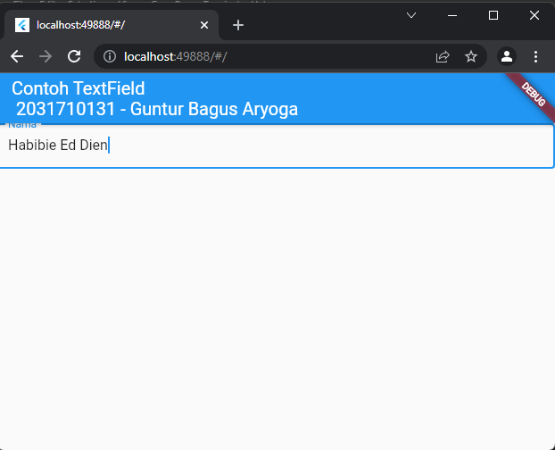
#### 8. Date and Time Pickers
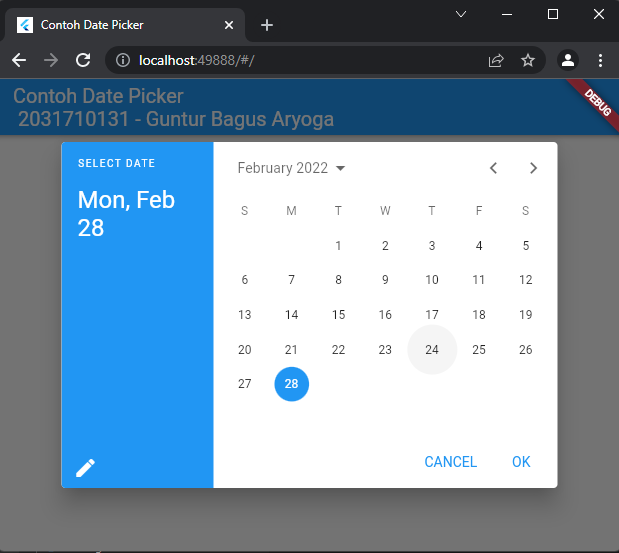

### Built In Widget
### (Container)
#### 1. Property Child
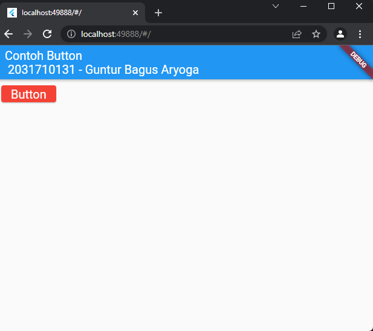
#### 2. Property Alignment
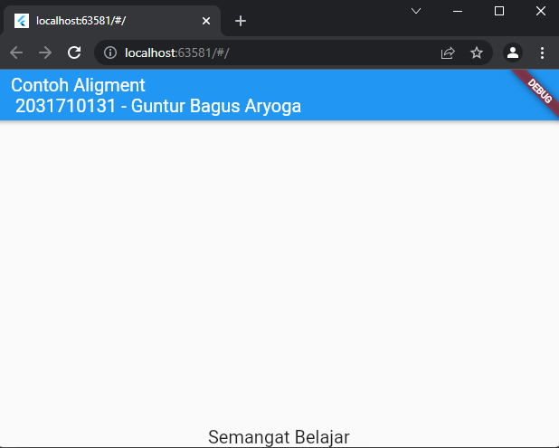
#### 3. Property Color

#### 4. Property Height and Width
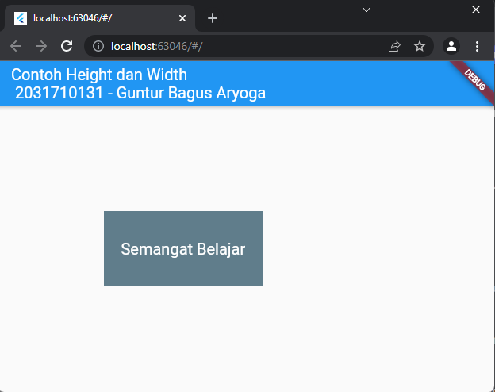
#### 5. Property Margin
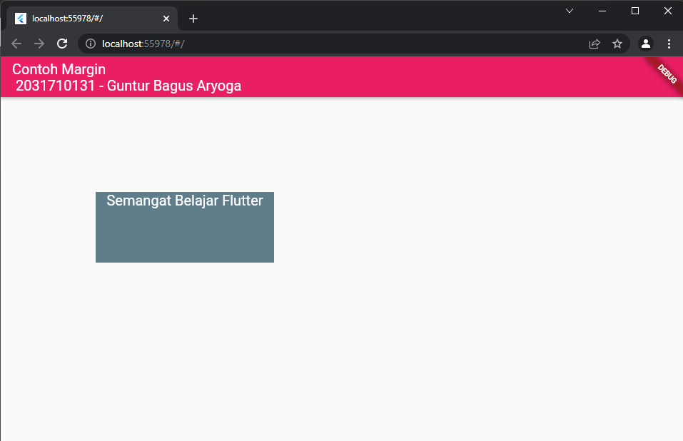
#### 6. Property Padding
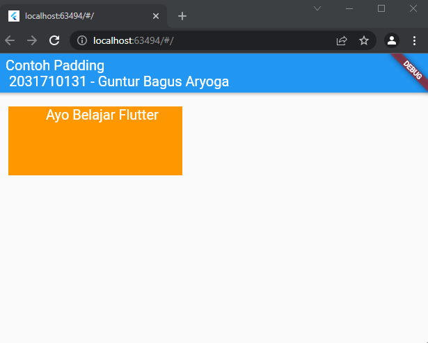
#### 7. Property Transform
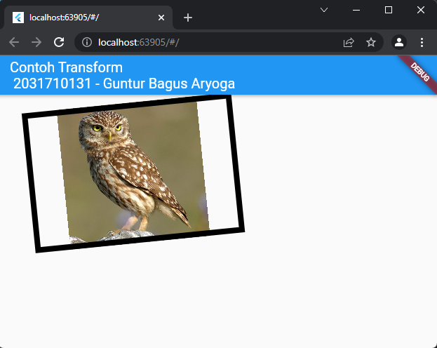
#### 8. Property Decoration
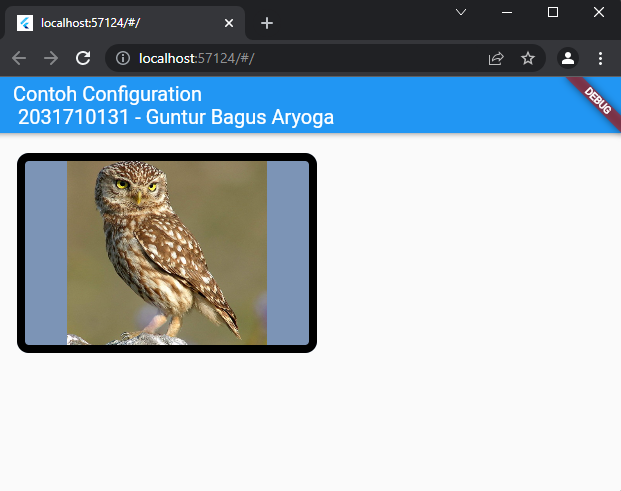

### (Row and Column)
#### 1. Column
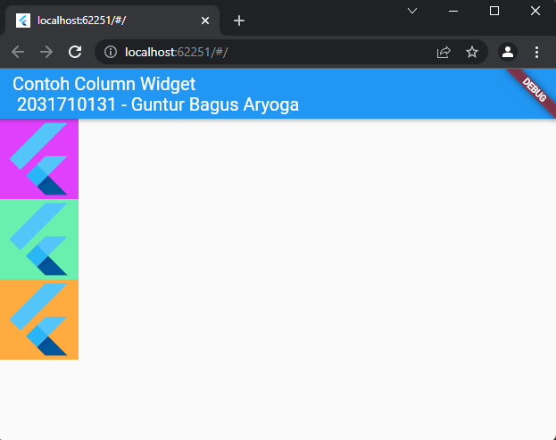
#### 2. Row
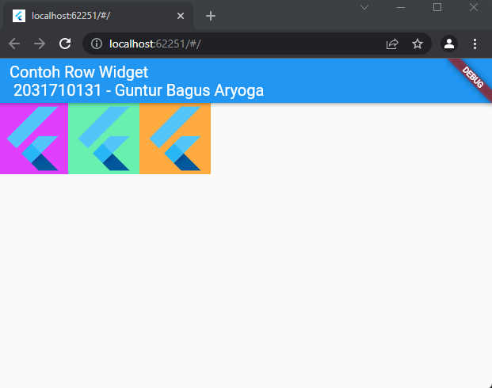

### (Stack)
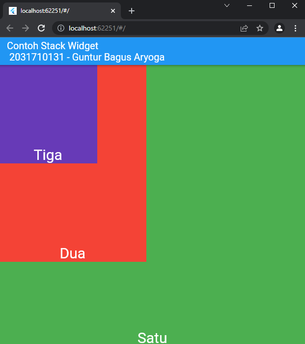

### (List View)
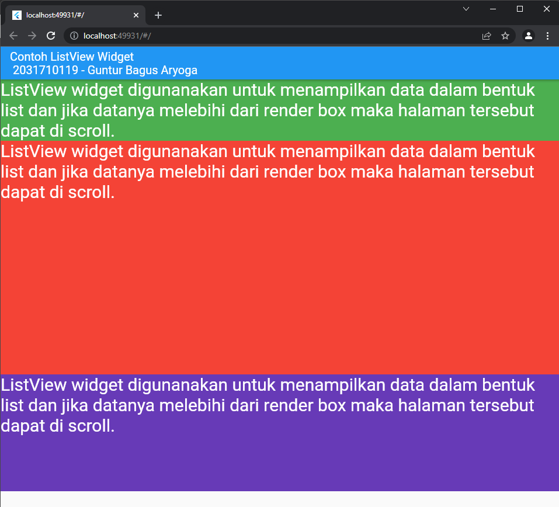

### (Grid View)
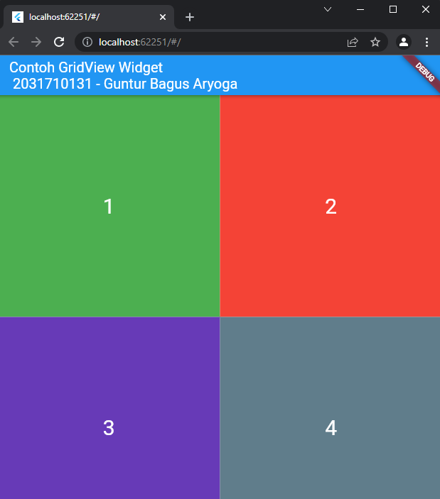

### HASIL PRAKTIKUM
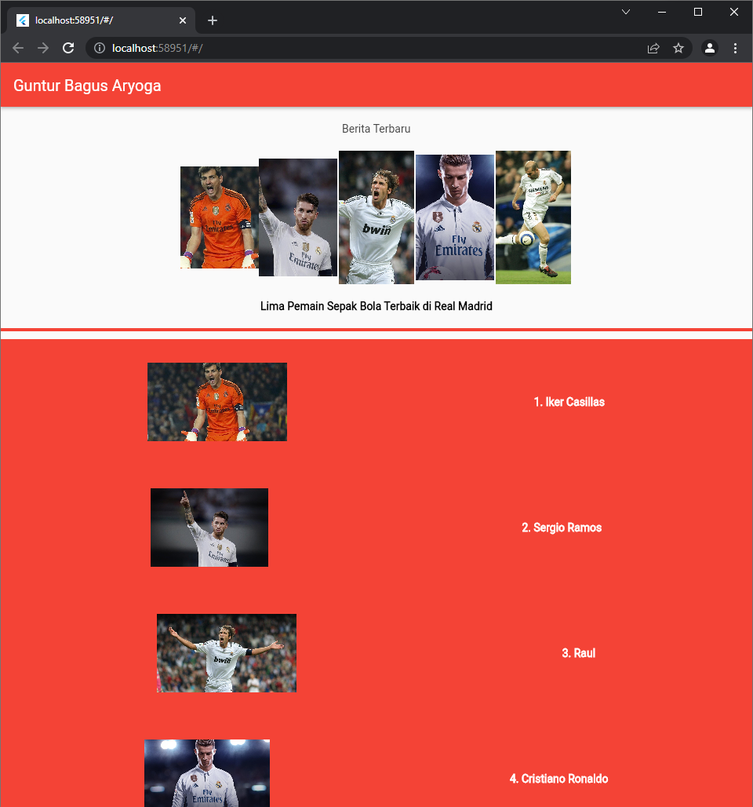
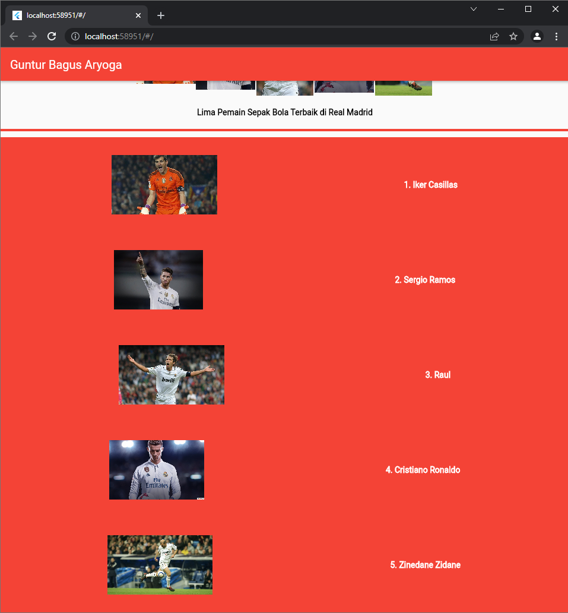
